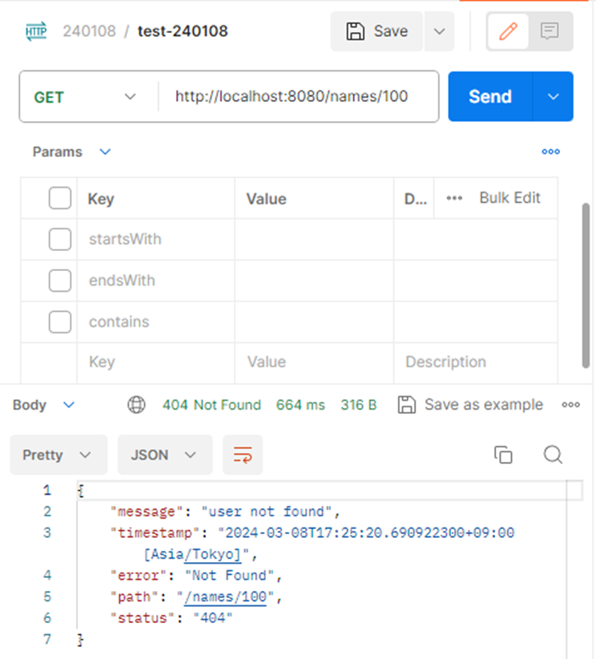

# 参考
- 例外をハンドリングする処理を`NameController`に記述した場合

**NameController**
```sh
package com.example.mybatisdemo202402;

import jakarta.servlet.http.HttpServletRequest;
import org.springframework.http.HttpStatus;
import org.springframework.http.ResponseEntity;
import org.springframework.web.bind.annotation.ExceptionHandler;
import org.springframework.web.bind.annotation.GetMapping;
import org.springframework.web.bind.annotation.PathVariable;
import org.springframework.web.bind.annotation.RestController;

import java.time.ZonedDateTime;
import java.util.List;
import java.util.Map;

@RestController
public class NameController {

    private final NameService nameService;

    public NameController(NameService nameService){
        this.nameService = nameService;
    }

    @GetMapping("/names")
    public List<Name> findNames(NameSearchRequest request){
        List<Name> names = nameService.findNames(request.getStartsWith(), request.getEndsWith(), request.getContains());
        return names;
    }

    @GetMapping("/names/{id}")
    public Name getNames(@PathVariable("id") int id){
        return nameService.findNames(id);
    }

    @ExceptionHandler(value = UserNotFoundException.class)
    public ResponseEntity<Map<String, String>> handleUserNotFoundException(
            UserNotFoundException e, HttpServletRequest request) {
        Map<String, String> body = Map.of(
                "message", e.getMessage(),
                "timestamp", ZonedDateTime.now().toString(),
                "error", HttpStatus.NOT_FOUND.getReasonPhrase(),
                "path", request.getRequestURI(),
                "status", String.valueOf(HttpStatus.NOT_FOUND.value()));

        return new ResponseEntity(body, HttpStatus.NOT_FOUND);
    }
}

```
