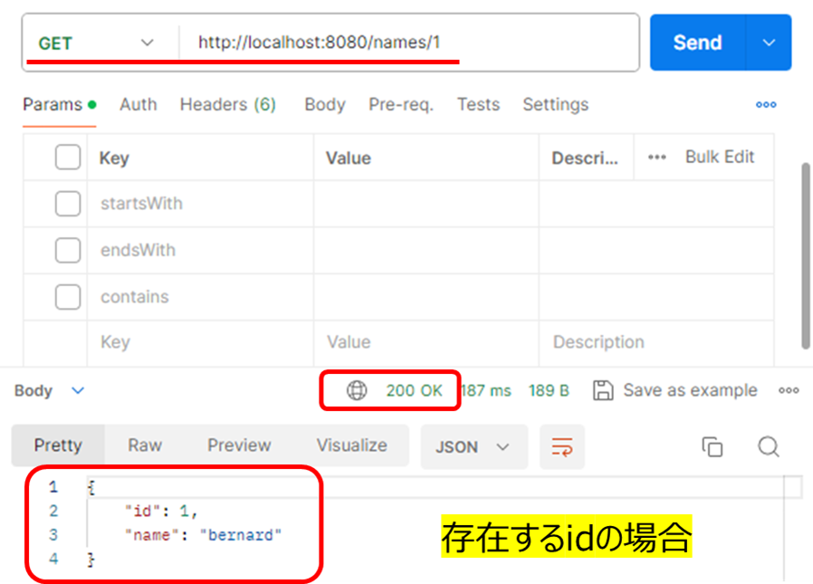
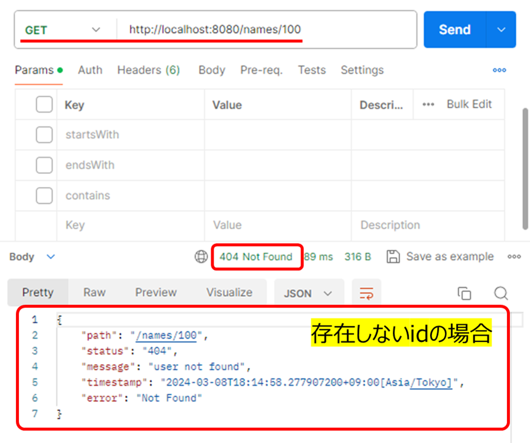

# 内容
第8回課題をベースに、以下内容にて例外をハンドリングする処理を実装する
- Service処理を実装する
- ExceptionHandlerのクラスを作成する

# 動作確認
### 前提:MySQL Databasesのnamesテーブル


### GETリクエスト    `http://localhost:8080/names/1`
1.存在するid=1の場合
- [x] HTTPステータスコード200を確認
- [x] id=1のデータがレスポンスボディに表示されていることを確認


2.存在しないid=100の場合
- [x] HTTPステータスコード404を確認
- [x] id=100は存在しないため、例外処理により以下内容を表示することを確認


  
  
***

# 参考
Windows Powershellではcurlコマンドはエラーとなる為、何か対策はないか調べたので覚えとして記述します。
#### 結論：複雑な為、必須でない限りLinuxの方がよい〇
  
- `curl`コマンドのエラー内容
```shell
PS C:\Users\Chisato\Documents\Java\No9> curl --location 'http://localhost:8080/names/100' -i
Invoke-WebRequest : パラメーター 'InFile' の引数が指定されていません。型 'System.String' のパラメーターを指定し、再試行してください。
発生場所 行:1 文字:51
+ curl --location 'http://localhost:8080/names/100' -i
+                                                   ~~
    + CategoryInfo          : InvalidArgument: (:) [Invoke-WebRequest]、ParameterBindingException
    + FullyQualifiedErrorId : MissingArgument,Microsoft.PowerShell.Commands.InvokeWebRequestCommand
```
  
- `$response = Invoke-WebRequest`：HTTPリクエストを送信してレスポンスを取得
```shell
PS C:\Users\Chisato\Documents\Java\No9> $response = Invoke-WebRequest -Uri 'http://localhost:8080/names/100' -Method GET -ErrorAction Stop
Invoke-WebRequest : リモート サーバーがエラーを返しました: (404) 見つかりません
発生場所 行:1 文字:13
+ $response = Invoke-WebRequest -Uri 'http://localhost:8080/names/100'  ...
+             ~~~~~~~~~~~~~~~~~~~~~~~~~~~~~~~~~~~~~~~~~~~~~~~~~~~~~~~~~
    + CategoryInfo          : InvalidOperation: (System.Net.HttpWebRequest:HttpWebRequest) [Invoke-WebRequest]、WebException
    + FullyQualifiedErrorId : WebCmdletWebResponseException,Microsoft.PowerShell.Commands.InvokeWebRequestCommand
```
  
- `$content = $response.Content`：レスポンスのコンテンツを取得
```shell
PS C:\Users\Chisato\Documents\Java\No9> $content = $response.Content
>> } catch {
>>     $errorResponse = $_.Exception.Response.GetResponseStream()
>>     $reader = New-Object System.IO.StreamReader($errorResponse)
>>     $errorContent = $reader.ReadToEnd()
>>     Write-Host $errorContent
>> }
{"path":"/names/100","status":"404","message":"user not found","timestamp":"2024-03-08T18:35:55.432889300+09:00[Asia/Tokyo]","error":"Not Found"}
```
  
- `$errorContent | ConvertFrom-Json`：JSON形式のエラーメッセージを表示
```shell
PS C:\Users\Chisato\Documents\Java\No9> $errorContent | ConvertFrom-Json


path      : /names/100
status    : 404
message   : user not found
timestamp : 2024-03-08T18:58:42.278215700+09:00[Asia/Tokyo]
error     : Not Found

```